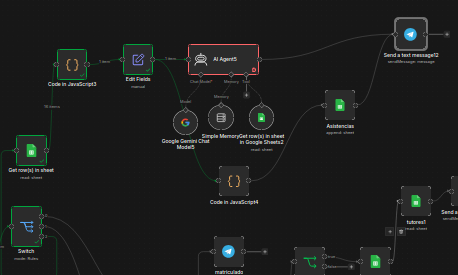
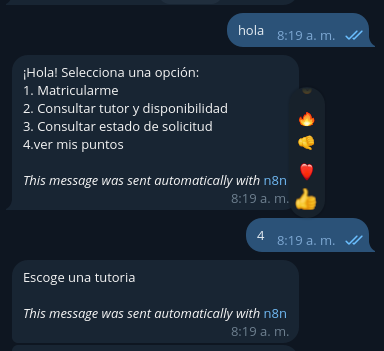

## Autor:

Sergio Ajù

## Descripcion:

Enfoque: Manipulación de datos matemáticos y actualización de perfiles de usuario.

Contexto para el estudiante: La coordinación quiere incentivar la asistencia puntual de los estudiantes a sus tutorías. Por cada tutoría marcada como "Finalizada", el estudiante debe acumular puntos.

Objetivo: Calcular puntos por asistencia e integrarlos en el perfil del estudiante.

## Resultado esperado:

Entregables Comunes

    Workflow actualizado: Archivo .json.
    README.md: Sección nueva titulada "Update: Examen [Número]" explicando la lógica implementada.

# Tecnologías Utilizadas
- n8n
- Telegram Bot API
- Google Sheets
- GitHub
- visual studio code

## flujo visual ya terminado: (evidencia)

flujo ya terminado sobre de sistema de puntos por cumplimiento.

